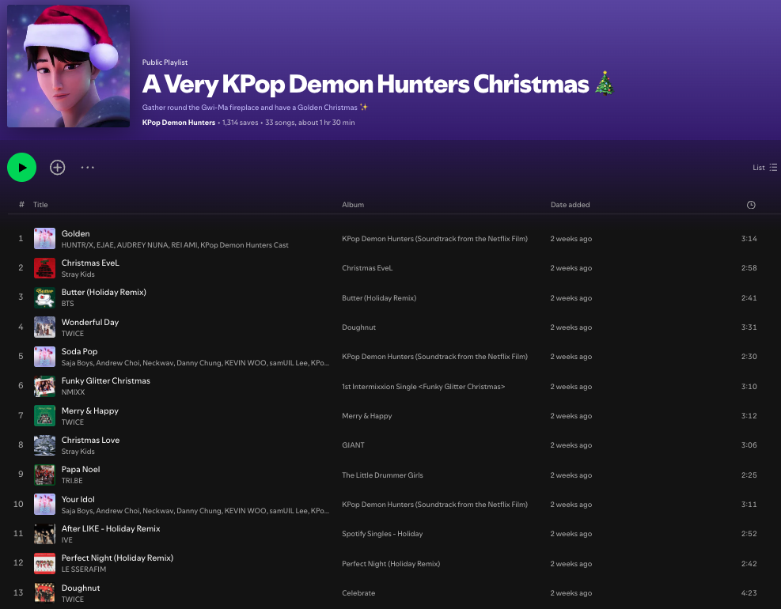
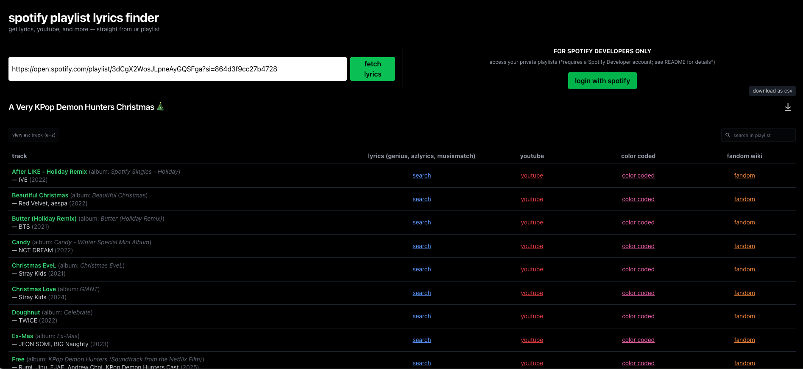

# spotify playlist lyrics finder

**have u always been looking for a way to not have to spend your time looking up lyrics of your playlist songs one by one and searching through multiple sources (genius, azlyrics, youtube, etc.)? 🤔⏳**  

well i have this app for you! ✩°｡ ⋆⸜ 🎧✮

Search any Spotify playlist and get lyrics, videos, and more — directly from your playlist! 

---

## Features

* 🎵 Search **any public Spotify playlist** by URL
* 🔐 Login with Spotify to access **private playlists** (note: you must have a Spotify Developer account: [Spotify for Developers](https://developer.spotify.com/))
* 📊 Browse a **5-column table of sources for each track**:
  * **Track Info** (song title, album, artist(s), year)
  * **Lyrics** (Genius / AZLyrics / Musixmatch)
  * **YouTube videos**
  * **Color Coded Lyrics**
  * **Fandom Wiki pages**
* 📥 **Download your results as CSV** — export all tracks with their links for easy sharing or reference
* 🎨 Clean, **dark Spotify-inspired UI** optimized for desktop and mobile
* 🌏 Especially helpful for **K-pop, other-language songs, and fictional tracks** from animated shows

---

## Demo of the Lyrics Finder app

Here’s an example using the playlist:

**A Very KPop Demon Hunters Christmas 🎄**  
By KPop Demon Hunters ([Spotify playlist link ](https://open.spotify.com/playlist/3dCgX2WosJLpneAyGQSFga?si=021fa5f7b84243e1))



> This playlist is from the official KPop Demon Hunters Spotify account and has been chosen because it includes both the Netflix show’s original soundtrack and K-pop songs — perfect for exploring YouTube videos, color-coded lyrics, and fandom wikis, which just a Genius search can’t provide.

## ➡️ The App in Action

Notice how you can quickly get **color coded lyrics**, watch **YouTube videos**, or explore **Fandom Wiki pages** for each track — perfect for K-pop or other non-English songs.

You can also **download all results as a CSV file** using the ⬇️ download button (top right corner) — hover over it to see the "download as csv" tooltip.




---

## Setup

### 1. Install Dependencies

```bash
npm install
```

### 2. Get API Credentials

**Spotify (required for private playlists):**

1. Go to [Spotify Developer Dashboard](https://developer.spotify.com/dashboard)
2. Create an app
3. Copy your `Client ID` and `Client Secret`
4. Add **redirect URI** in your Spotify app settings:
   * **Local development:** `http://127.0.0.1:8000/callback`
   * **Production / deployed site (e.g., Vercel):** `https://your-app-name.vercel.app/callback`
     
### 3. Create `.env.local`

```env
SPOTIFY_CLIENT_ID=your_client_id
SPOTIFY_CLIENT_SECRET=your_client_secret
SPOTIFY_REDIRECT_URI=http://127.0.0.1:8000/callback  # change to your deployed URL in production
```


### 4. Run Development Server

```bash
npm run dev -- --port 8000
```
Visit [http://127.0.0.1:8000](http://127.0.0.1:8000)

---

## Build for Production

```bash
npm run build
npm run preview
```

---

## Deploy

Can be deployed to:

* [Vercel](https://vercel.com)
* [Netlify](https://netlify.com)
* [GitHub Pages](https://pages.github.com)

---

## ⚠️ Limitations / Notes

* Private playlists require **Spotify login / OAuth** — public playlists work without authentication.
* Lyrics links are **search-based** (Genius, AZLyrics, Musixmatch) and may **not always point to the exact lyrics**.
* YouTube videos and Fandom Wiki links may occasionally be missing if the track is rare or not widely documented.
* **CSV export** contains Google search links (not direct lyrics) — perfect for batch research or sharing with others.
* Track info is pulled directly from Spotify and displayed in the format:

```
Golden (album: KPop Demon Hunters (Soundtrack from the Netflix Film))
— HUNTR/X, EJAE, AUDREY NUNA, REI AMI, KPop Demon Hunters Cast (2025)
```

---
### 👩‍💻 Author

Built by **elisesykimgit**

> Full-stack system designed and implemented end-to-end for this project.

GitHub: [https://github.com/elisesykimgit](https://github.com/elisesykimgit)

---

⭐ If this project helps you, please star the repo!
